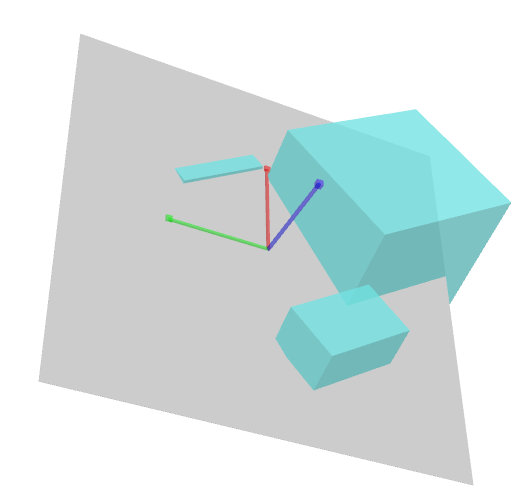

# Grasp Proposal Networks: An End-to-End Solution for Visual Learning of Robotic Grasps 
Pytorch implementation of [GPNet](https://arxiv.org/abs/2009.12606).
 

## Activate virtual environment (installed)
```
conda activate gym
```

- Ubuntu 16.04 
- pytorch 0.4.1 
- torchvision 0.2.1
- CUDA 8.0 or CUDA 9.2

Our depth images are saved in `.exr` files, please install the [OpenEXR](https://github.com/AcademySoftwareFoundation/openexr/blob/master/INSTALL.md), then run `pip install OpenEXR`.

## Build CUDA kernels (installed)
- ``cd lib/pointnet2``
- ``mkdir build && cd build``
- ``cmake .. && make``

## Dataset
Our dataset is available at [Google Driver](https://drive.google.com/file/d/1hZmQhuTrKRn8BMyAq-bI13rQSrdGQdJH/view?usp=sharing). 
[Backup](https://pan.baidu.com/s/1Gf0cIgaL1s30n22z7sOuRA) (2qln).

## Simulation Environment (installed)
The simulation environment is built on [PyBullet](https://pybullet.org/wordpress/). You can use `pip` to install the python packages: 
````
pip install pybullet
pip install attrdict
pip install trimesh
pip install collections
pip install joblib
pip install gc
````
Please look for the details of our simulation configurations in the directory `simulator`. The simulation environment will be available soon.

## Training
``CUDA_VISIBLE_DEVICES=0,1 python train --tanh --grid --dataset_root path_to_dataset``

For our situtation,  only 1 GPU, the following items shoud be changed accordingly.
1.change the  following lines with cuda(0)  in train.py file
```
proposal_PC, grids1, contact_index1, center1, scores1 = pc_.float().cuda(0),\
                                                                    grids_.float().cuda(0),\
                                                                    contact_index_.long().cuda(0),\
                                                                    center_.float().cuda(0),\
                                                                    scores_.float().cuda(0)
                                                                    
grasp_center1 = grasp_center_.cuda(0)                                                                                                              
grasp_contact1 = grasp_contact_.cuda(0)
```
2.Changing the values in file gpnet.py
```
emacs ../lib/gpnet.py #L345
emacs ../lib/gpnet.py #L404
change the 5000 to 1000
```

Then, run the training by
```
CUDA_VISIBLE_DEVICES=0 python train.py --tanh --grid --dataset_root /home/user/GPNet/dataset/GPNet_release_data
```

- ImportError: cannot import name 'pytorch_utils'
```
copy the file pytorch_utils.py from https://github.com/sshaoshuai/Pointnet2.PyTorch/tree/master/pointnet2  
and paste to ~/GPNet/lib/pointnet2/utils
```

## Test
````
CUDA_VISIBLE_DEVICES=0,1 python test --tanh --grid --dataset_root path_to_dataset --resume pretrained_model/checkpoint_440.pth.tar
````

In our situation, we only have 1 GPU
```
CUDA_VISIBLE_DEVICES=0 python test.py --tanh --grid --dataset_root /home/user/GPNet/dataset/GPNet_release_data --resume /home/user/GPNet/log_exp_tanh_grid/gridlen22_gridnum10/bs1_wd0.0001_lr0.001_lamb0.01_ratio1.0_posi0.3_sgd/checkpoint_500.pth.tar
```


Then it will generate the predicted grasps saved in `.npz` files in `pretrained_model/test/epoch440/view0`. The file `pretrained_model/test/epoch440/nms_poses_view0.txt` contains the predicted grasps after nms.

## Rule-based evaluation
You can use the following script to abtain the success rate and coverage rate.

````
CUDA_VISIBLE_DEVICES=0 python topk_percent_coverage_precision.py -pd pretrained_model/test/epoch440/view0 -gd path_to_gt_annotations
````
i.e.
```
CUDA_VISIBLE_DEVICES=0 python topk_percent_coverage_precision.py -pd /home/user/GPNet/log_exp_tanh_grid/gridlen22_gridnum10/bs1_wd0.0001_lr0.001_lamb0.01_ratio1.0_posi0.3_sgd/test/epoch500/view0 -gd /home/user/GPNet/dataset/GPNet_release_data
```

## Simulation-based evaluation
To test the predicted grasps in simulation environment:
````
cd simulator
python -m simulateTest.simulatorTestDemo -t pretrained_model/test/epoch440/nms_poses_view0.txt
````
i.e.
```
python -m simulateTest.simulatorTestDemo -t /home/user/GPNet/log_exp_tanh_grid/gridlen22_gridnum10/bs1_wd0.0001_lr0.001_lamb0.01_ratio1.0_posi0.3_sgd/test/epoch500/nms_poses_view0.txt
```

Results of the scripts in simulator 
```
python -m simulateTest.gripperSimpleCollision
```
 

```
python -m simulateTest.gripperPoseTransform
```
 

```
python -m simulateTest.visualization
```
 

## Citation
````
@article{wu2020grasp,
  title={Grasp Proposal Networks: An End-to-End Solution for Visual Learning of Robotic Grasps},
  author={Wu, Chaozheng and Chen, Jian and Cao, Qiaoyu and Zhang, Jianchi and Tai, Yunxin and Sun, Lin and Jia, Kui},
  journal={arXiv preprint arXiv:2009.12606},
  year={2020}
}
````

## Acknowledgement
The code of pointnet2 are borrowed from [Pointnet2_PyTorch](https://github.com/erikwijmans/Pointnet2_PyTorch).
